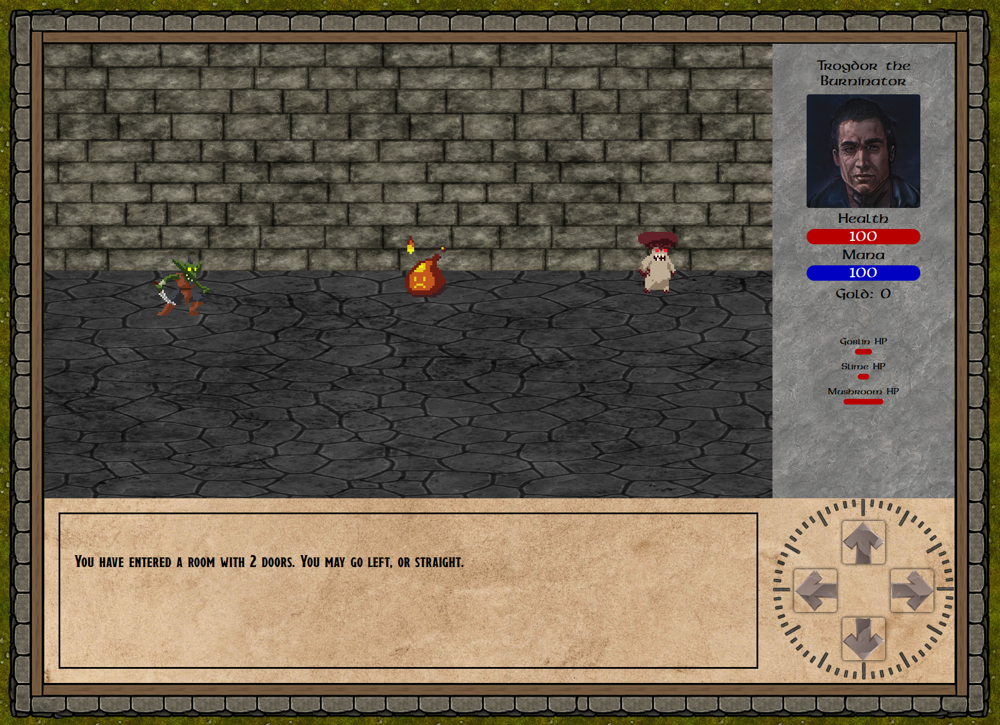
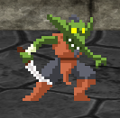
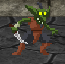

### !Another Dungeon Crawler is a quasi-procedurally generated dungeon crawling adventure. Explore a dingy dungeon, fighting monsters and collecting treasure! Can you survive long enough to find the boss?
---
## [Launch Game!](https://not-another-dungeon-crawler.netlify.app/)
> Planning board can be found on [Trello](https://trello.com/b/EX9tzIpp/anotherdungeoncrawler).
---

## How to play

#### **Main Display** 
This is the main render area of the game.

#### **Character Panel** 
This is where your health, mana, and gold are displayed.[^1]

#### **Monster Health Area** 
This is where health bars and nameplates for the monsters are displayed.

#### **Navigation Panel** 
- Up Arrow : Moves you forward, through the door.
- Left Arrow : Moves you through the left door.
- Right Arrow : Moves you through the right door.
- Back Arrow : Retreats to the last room you were in.

#### **Game Log** 
Text about your adventure will be displayed here.

### Combat

- Combat works by clicking on the monster you want to attack.
- Every monster has a custom animation, and will hit you back when attacked, so pick your fights!
- Combat can be run away from by clicking the 'back' arrow in the navigation pane.
- Monsters drop gold upon death.

This is a monster that is targeted.

This is a monster that is not targeted.

### Technologies Used
- 
- 
- 
- 
- 

### Planned Features
- [x] Test feature
- [ ] feature 2

[^1]: Mana not currently implemented. 

### Attributions:
- Arrow Buttons by [upklyak on Freepik](https://www.freepik.com/free-vector/set-progress-bars-game-buttons-menu-ui-gui-elements-cartoon-interface-stone-texture-user-setting-panel-slider-pause-arrows-power-life-scale-login-password-board-vector-icons_20731575.htm#query=rpg&position=28&from_view=search&track=sph?sign-up=google)
- Textures from [Forgotten Adventures](https://www.forgotten-adventures.net/)
- 'Breathe Fire II' font by [by Chequered Ink](https://www.fontspace.com/breathe-fire-ii-font-f31570)
- Chest / Mimic sprites from [Will Tice](untiedgames.itch.io)
- Monster sprites from [Luiz Melo](https://luizmelo.itch.io/monsters-creatures-fantasy)
- More sprites from [Chierit](https://chierit.itch.io/)
- Character portraits from [Fantasy Faces](https://www.fantasy-faces.com/)
- Music by [Marllon Silva a.k.a xDeviruchi](https://xdeviruchi.itch.io/8-bit-fantasy-adventure-music-pack)

