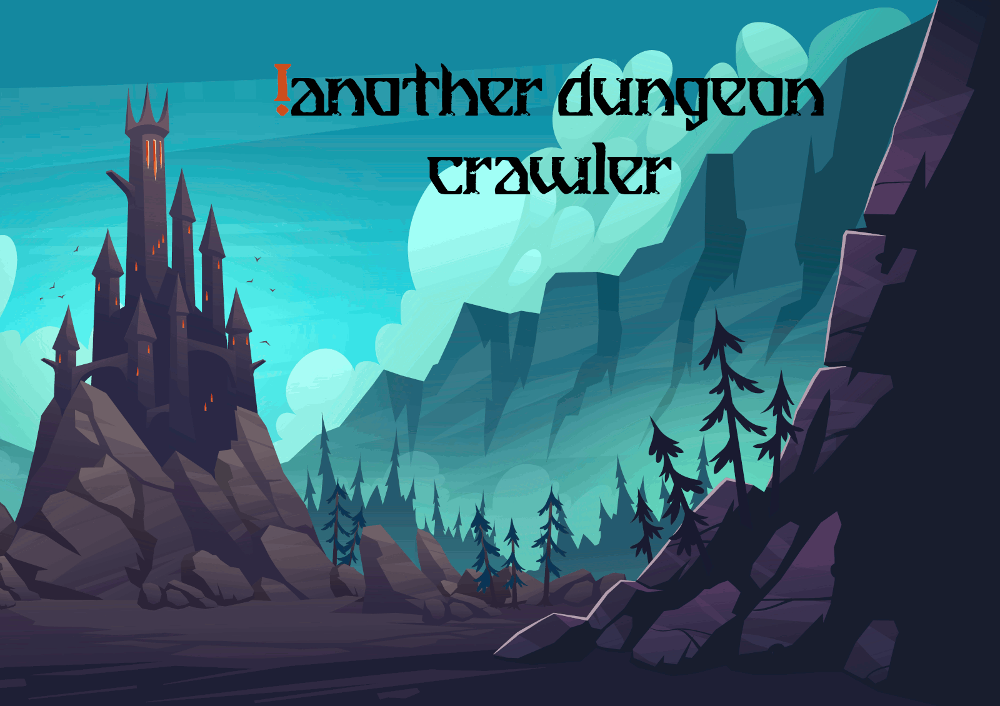
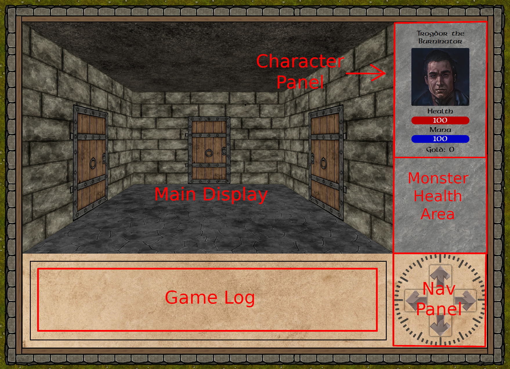

### !Another Dungeon Crawler is a quasi-procedurally generated dungeon crawling adventure. Explore a dingy dungeon, fighting monsters and collecting treasure! Can you survive long enough to find the boss?
---
## [Launch Game!](https://not-another-dungeon-crawler.netlify.app/)
> Planning board can be found on [Trello](https://trello.com/b/EX9tzIpp/anotherdungeoncrawler).
---

## How to play

- this is where i describe the ui panel

- this is where I describe combat

### Technologies Used
- list here

### Planned Features
- list here

### Attributions:
- Arrow Buttons by [upklyak on Freepik](https://www.freepik.com/free-vector/set-progress-bars-game-buttons-menu-ui-gui-elements-cartoon-interface-stone-texture-user-setting-panel-slider-pause-arrows-power-life-scale-login-password-board-vector-icons_20731575.htm#query=rpg&position=28&from_view=search&track=sph?sign-up=google)
- Textures from [Forgotten Adventures](https://www.forgotten-adventures.net/)
- 'Breathe Fire II' font by [by Chequered Ink](https://www.fontspace.com/breathe-fire-ii-font-f31570)
- Chest / Mimic sprites from [Will Tice](untiedgames.itch.io)
- Monster sprites from [Luiz Melo](https://luizmelo.itch.io/monsters-creatures-fantasy)
- Character portraits from [Fantasy Faces](https://www.fantasy-faces.com/)

